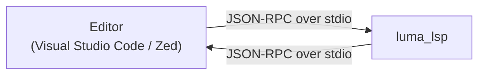

# Luma — Language Server

This document describes the design goals, scope, and architecture of the minimal Luma language server, as well as the implementation strategy, module decomposition, data flow, and JSON-RPC handling.

---

## Table of Contents

1. [Overview](#1--overview)
2. [Goals](#2--goals)
3. [Non-Goals](#3--non-goals)
4. [Architecture](#4--architecture)
5. [Supported LSP Methods](#5--supported-lsp-methods)
6. [Diagnostics](#6--diagnostics)
7. [Hover](#7--hover)
8. [Completion](#8--completion)
9. [Document Management](#9--document-management)
10. [Standard Library Support](#10--standard-library-support)
11. [Platform Support](#11--platform-support)
12. [Usage](#12--usage)
13. [Editor Integration](#13--editor-integration)
14. [File Layout](#14--file-layout)
15. [Module Responsibilities](#15--module-responsibilities)
16. [Data Flow](#16--data-flow)
17. [JSON-RPC Dispatch](#17--json-rpc-dispatch)
18. [Capability Negotiation](#18--capability-negotiation)
19. [Stdlib Signature Access](#19--stdlib-signature-access)
20. [Build Integration](#20--build-integration)
21. [Error Handling](#21--error-handling)
22. [Logging](#22--logging)
23. [Platform-Specific Handling](#23--platform-specific-handling)

- [See Also](#see-also)

---

## 1 — Overview

The Luma language server implements the [Language Server Protocol](https://microsoft.github.io/language-server-protocol/) (LSP) to provide real-time diagnostics and type information to editors. The server is a standalone C++ executable that communicates over standard input/output using JSON-RPC 2.0.

A single binary serves both Visual Studio Code and Zed. It runs on Windows, Ubuntu, and macOS without platform-specific code beyond what the existing Luma interpreter already handles.

---

## 2 — Goals

- Report syntax errors and type errors as the user types.
- Show type information and function signatures on hover.
- Provide completion suggestions for standard library module members.
- Reuse the existing Luma lexer, parser, and type checker without duplication.
- Keep the server minimal: no interpreter, no runtime execution, no file I/O beyond reading source files.

---

## 3 — Non-Goals

The following features remain out of scope:

- Incremental parsing (full re-parse on every change).

---

## 4 — Architecture



The server is a single-threaded, synchronous process. The editor spawns it as a child process and communicates via standard input/output using the LSP base protocol (HTTP-style `Content-Length` headers followed by JSON-RPC messages).

### Pipeline

Each time the editor sends a document change notification, the server runs the full analysis pipeline:


The server maintains an in-memory copy of each open document. When a document changes, the server replaces the stored text, re-runs the pipeline, and publishes diagnostics.

---

## 5 — Supported LSP Methods

### Lifecycle

| Method        | Direction       | Purpose                |
| ------------- | --------------- | ---------------------- |
| `initialize`  | Client → Server | Negotiate capabilities |
| `initialized` | Client → Server | Handshake complete     |
| `shutdown`    | Client → Server | Prepare to exit        |
| `exit`        | Client → Server | Terminate process      |

### Document Synchronisation

| Method                             | Direction       | Purpose                                          |
| ---------------------------------- | --------------- | ------------------------------------------------ |
| `textDocument/didOpen`             | Client → Server | Store document text, publish initial diagnostics |
| `textDocument/didChange`           | Client → Server | Update stored text, re-publish diagnostics       |
| `textDocument/didClose`            | Client → Server | Remove document from memory                      |
| `workspace/didChangeWatchedFiles`  | Client → Server | Re-analyse when included files change on disk    |
| `workspace/didChangeConfiguration` | Client → Server | Update server configuration from editor settings |

The server uses **full document sync** (`TextDocumentSyncKind.Full`). The editor sends the entire document text on every change. This avoids the complexity of incremental text synchronisation.

### Language Features

| Method                                   | Direction       | Purpose                                                          |
| ---------------------------------------- | --------------- | ---------------------------------------------------------------- |
| `textDocument/hover`                     | Client → Server | Return type information for the symbol under the cursor          |
| `textDocument/completion`                | Client → Server | Return completion items for stdlib members, keywords, and locals |
| `completionItem/resolve`                 | Client → Server | Enrich a completion item with additional detail                  |
| `textDocument/signatureHelp`             | Client → Server | Show parameter hints during function calls                       |
| `textDocument/definition`                | Client → Server | Navigate to the declaration of a symbol                          |
| `textDocument/typeDefinition`            | Client → Server | Navigate to the type definition of a symbol                      |
| `textDocument/implementation`            | Client → Server | Navigate to implementations of an interface                      |
| `textDocument/references`                | Client → Server | Find all references to a symbol                                  |
| `textDocument/documentHighlight`         | Client → Server | Highlight all occurrences of a symbol in the document            |
| `textDocument/documentSymbol`            | Client → Server | Return the document outline (functions, types, namespaces)       |
| `textDocument/codeAction`                | Client → Server | Suggest quick fixes for diagnostics                              |
| `textDocument/codeLens`                  | Client → Server | Return code lens annotations (test counts, references)           |
| `textDocument/formatting`                | Client → Server | Format the entire document                                       |
| `textDocument/rangeFormatting`           | Client → Server | Format a selected range                                          |
| `textDocument/rename`                    | Client → Server | Rename a symbol across the document                              |
| `textDocument/prepareRename`             | Client → Server | Validate and return the range of the symbol to rename            |
| `textDocument/foldingRange`              | Client → Server | Return foldable regions (functions, blocks, comments)            |
| `textDocument/selectionRange`            | Client → Server | Return smart selection ranges for expand/shrink selection        |
| `textDocument/inlayHint`                 | Client → Server | Return inline type and parameter name hints                      |
| `textDocument/linkedEditingRange`        | Client → Server | Return linked editing ranges for simultaneous edits              |
| `textDocument/documentLink`              | Client → Server | Return clickable links for `include` paths                       |
| `textDocument/semanticTokens/full`       | Client → Server | Provide semantic highlighting tokens for the full document       |
| `textDocument/semanticTokens/full/delta` | Client → Server | Provide incremental semantic token updates                       |
| `textDocument/semanticTokens/range`      | Client → Server | Provide semantic tokens for a visible range                      |
| `textDocument/prepareCallHierarchy`      | Client → Server | Prepare a call hierarchy item at the cursor                      |
| `callHierarchy/incomingCalls`            | Client → Server | Return callers of a function                                     |
| `callHierarchy/outgoingCalls`            | Client → Server | Return callees of a function                                     |
| `textDocument/prepareTypeHierarchy`      | Client → Server | Prepare a type hierarchy item at the cursor                      |
| `typeHierarchy/supertypes`               | Client → Server | Return supertypes (interfaces) of a type                         |
| `typeHierarchy/subtypes`                 | Client → Server | Return subtypes (implementors) of an interface                   |
| `workspace/symbol`                       | Client → Server | Search for symbols across the workspace                          |
| `workspace/executeCommand`               | Client → Server | Execute a server-side command                                    |

### Cancellation

| Method            | Direction       | Purpose                            |
| ----------------- | --------------- | ---------------------------------- |
| `$/cancelRequest` | Client → Server | Cancel a pending request by its ID |

---

## 6 — Diagnostics

The server maps Luma errors and warnings to LSP `Diagnostic` objects. The analysis pipeline emits structured `Diagnostic` values via `DiagnosticEmitter`. Runtime `RuntimeError` exceptions from unexpected failures are caught, converted to a single-span `Diagnostic`, and published.

| Diagnostic Category | LSP Severity | Source          |
| ------------------- | ------------ | --------------- |
| `Syntax`            | Error        | Lexer or parser |
| `Type`              | Error        | Type checker    |
| `Compile`           | Error        | Compiler        |
| `Warning`           | Warning      | Linter          |

Each diagnostic carries:

- **Range:** derived from the `SourceLocation` (line and column) attached to every error.
- **Message:** the error's `what()` string.
- **Source:** `"luma"` (identifies the language server in the editor's diagnostics panel).

Diagnostics are published via `textDocument/publishDiagnostics` after every document change. When a document is closed, an empty diagnostics array is published to clear stale markers.

---

## 7 — Hover

When the user hovers over a token, the server identifies the token at the cursor position and returns type information:

- **Standard library module names** (e.g., `Math`): the hover shows `namespace Math` and the number of available functions.
- **Standard library function calls** (e.g., `Math.floor`): the hover shows the return type from the stdlib signature registry.
- **Type keywords and literals:** the hover shows the type (e.g., `integer`, `string`, `boolean`).

The hover response uses Markdown formatting for readability.

---

## 8 — Completion

Completion is triggered when the user types `.` after a standard library module name (e.g., `Math.`). The server:

1. Identifies the module name from the text preceding the cursor.
2. Looks up all functions registered for that module in the stdlib signature registry.
3. Returns a `CompletionItem` for each function with the function name and return type.

Completion items use `CompletionItemKind.Function` and include the return type as detail text.

---

## 9 — Document Management

The server maintains a `std::unordered_map<std::string, std::string>` mapping document URIs to their current text content. Documents are added on `didOpen`, updated on `didChange`, and removed on `didClose`.

URIs are stored as-is from the LSP client. The server does not resolve file paths or access the file system — all content comes from the editor via the protocol.

---

## 10 — Standard Library Support

The type checker's `stdlib_signatures_` registry contains 700+ function entries mapping `"Module.function"` to their return types. The server exposes these for:

- **Hover:** showing the return type of a stdlib call.
- **Completion:** listing all functions within a module when the user types `Module.`.

The 39 standard library modules (`Array`, `Bits`, `Calculus`, `Channel`, `Color`, `Compression`, `Console`, `Converter`, `Csv`, `DateTime`, `Decimal`, `Dictionary`, `Encoder`, `FileSystem`, `GraphicalUi`, `Hash`, `Http`, `Json`, `KeyValueStore`, `LinearAlgebra`, `Log`, `Math`, `Optional`, `Order`, `Process`, `Queue`, `Random`, `Reference`, `RegularExpression`, `Resource`, `Result`, `Set`, `Socket`, `Stack`, `Statistics`, `String`, `Task`, `Terminal`, `Xml`) are covered by this registry.

---

## 11 — Platform Support

The server uses only C++20 standard library features and communicates over `stdin`/`stdout`. The one exception is the shared stdio transport, which on Windows sets `stdin`/`stdout` to binary mode (`_setmode`) so `\r\n` translation cannot corrupt `Content-Length` framing — see [§23 — Platform-Specific Handling](#23--platform-specific-handling). The existing CMake build system already targets Windows (MSVC), Ubuntu (GCC), and macOS (Clang).

The server binary is named `luma_lsp` (or `luma_lsp.exe` on Windows).

---

## 12 — Usage

### Building

The `luma_lsp` target is part of the main CMake build. No extra flags are needed:

```bash
cmake -B build -DCMAKE_BUILD_TYPE=Release
cmake --build build --config Release --parallel
```

This produces `build/luma_lsp` on Linux and macOS, or `build\Release\luma_lsp.exe` on Windows with MSVC.

### Running

The server reads JSON-RPC messages from **stdin** and writes responses to **stdout**. It accepts no command-line arguments. Editors start it automatically (see [Editor Integration](#13--editor-integration) below), but you can also launch it manually for debugging:

```bash
build/luma_lsp              # Linux / macOS
build\Release\luma_lsp.exe  # Windows (MSVC)
```

The server blocks on stdin, waiting for LSP messages. Send an `initialize` request followed by `initialized` to begin a session. Send `shutdown` and then `exit` to stop the server.

### Verifying the Server

A quick smoke test with a hand-crafted LSP `initialize` request:

```bash
echo 'Content-Length: 57\r\n\r\n{"jsonrpc":"2.0","id":1,"method":"initialize","params":{}}' | build/luma_lsp
```

The server should respond with a JSON-RPC message containing its capabilities.

### Project Configuration (`luma.json`)

The language server reads a `luma.json` file from the workspace root for per-project settings. Create one with `luma init`, or write it manually. All fields are optional — omitted fields use their defaults.

```json
{
    "inlayHints": { "enabled": true },
    "codeLens": { "enabled": true },
    "diagnostics": { "onSave": false },
    "analysisDebounceMs": 50,
    "analysisTimeoutMs": 10000
}
```

| Setting | Type | Default | Description |
|---------|------|---------|-------------|
| `inlayHints.enabled` | `boolean` | `true` | Show inline type annotations and parameter name hints. |
| `codeLens.enabled` | `boolean` | `true` | Show reference counts and test annotations above functions. |
| `diagnostics.onSave` | `boolean` | `false` | When `true`, diagnostics are only published on file open and save — not while typing. Analysis still runs on every keystroke (hover and completion stay fresh), but red/yellow squiggles update only on save. Useful on large files where live diagnostics are distracting. |
| `analysisDebounceMs` | `integer` | `50` | Milliseconds to wait after the last keystroke before starting analysis. Range: 0–5000. Increase on slow machines to reduce CPU usage during rapid typing. |
| `analysisTimeoutMs` | `integer` | `10000` | Maximum time (ms) for a single analysis pass before it is cancelled. Range: 100–60000. Increase for very large files that time out. |

Settings can also be configured per-editor (VS Code settings UI or Zed's `settings.json`). The editor sends changes to the server via `workspace/didChangeConfiguration`; a `luma.json` in the workspace root takes priority for project-wide consistency.

---

## 13 — Editor Integration

### Visual Studio Code

The existing VS Code extension (`extensions/vscode/`) gains an LSP client that spawns `luma_lsp` as a child process. The client is implemented in TypeScript using the `vscode-languageclient` npm package. The extension activates when a `.luma` file is opened and starts the language server.

### Zed

The existing Zed extension (`extensions/zed/`) adds a `[language_servers.luma-lsp]` entry to `extension.toml` and a Rust WASM component (`Cargo.toml` + `src/lib.rs`) that implements `language_server_command`. The WASM code uses `Worktree::which("luma_lsp")` to locate the binary on `PATH`. Zed compiles the Rust source to `wasm32-wasip1` and handles LSP client communication natively.

---

## 14 — File Layout

```text
language-server/
└── source/
    ├── lsp_analysis_cache.cpp          # Cached analysis result storage
    ├── lsp_analysis_cache.hpp          # AnalysisCache class declaration
    ├── lsp_analysis_pipeline.cpp       # Background analysis execution and result processing
    ├── lsp_analysis_pipeline.hpp       # AnalysisPipeline class declaration
    ├── lsp_analysis_result.hpp         # Analysis result types for worker thread
    ├── lsp_analysis_service.hpp        # AnalysisService interface
    ├── lsp_analysis_service_impl.cpp   # AnalysisService implementation
    ├── lsp_analysis_service_impl.hpp   # AnalysisServiceImpl class declaration
    ├── lsp_analysis_service_symbols.cpp # Symbol collection and AST analysis utilities
    ├── lsp_analysis_view.hpp           # Read-only facade for analysis results
    ├── lsp_binary_format.hpp           # Binary serialisation helpers for persisted index
    ├── lsp_brace_matcher.hpp           # Brace matching utilities
    ├── lsp_cancellation_manager.hpp    # Thread-safe request cancellation tracking
    ├── lsp_capabilities.cpp            # Server capability registration
    ├── lsp_capabilities.hpp            # Capabilities declaration
    ├── lsp_code_action_builder.hpp     # Fluent builder for code action construction
    ├── lsp_code_action_handler.hpp     # Code action handler interface
    ├── lsp_completion_handler.hpp      # Completion handler interface
    ├── lsp_completion_provider.cpp     # Completion provider registry and aggregation
    ├── lsp_completion_provider.hpp     # CompletionProvider strategy interface
    ├── lsp_completion_strategy.cpp     # Completion strategy implementations
    ├── lsp_completion_strategy.hpp     # Completion strategy declarations
    ├── lsp_config.hpp                  # Server configuration constants
    ├── lsp_configuration_manager.cpp   # Runtime configuration handling
    ├── lsp_configuration_manager.hpp   # ConfigurationManager class declaration
    ├── lsp_constants.hpp               # Centralised LSP constants (methods, sort priorities, types)
    ├── lsp_definition_resolver.hpp     # Symbol lookup to LSP location translation
    ├── lsp_diagnostic_builder.cpp      # Diagnostic construction
    ├── lsp_diagnostic_builder.hpp      # DiagnosticBuilder class declaration
    ├── lsp_diagnostic_codes.hpp        # Diagnostic code constants
    ├── lsp_document_store.cpp          # Open document text storage
    ├── lsp_document_store.hpp          # DocumentStore class declaration
    ├── lsp_document_synchronizer.cpp   # Document update and cache management
    ├── lsp_document_synchronizer.hpp   # DocumentSynchronizer class declaration
    ├── lsp_exception_utils.hpp         # Exception formatting utility for catch(...) blocks
    ├── lsp_folding_handler.hpp         # Folding range handler interface
    ├── lsp_formatting_handler.hpp      # Formatting handler interface
    ├── lsp_hover_literals.cpp          # Hover content data table for literals
    ├── lsp_hover_literals.hpp          # Hover content for literal expressions
    ├── lsp_handler_context.hpp         # Shared context passed to handlers
    ├── lsp_handler_registry.hpp        # HandlerRegistry class declaration (header-only)
    ├── lsp_hierarchy_handler.hpp       # Hierarchy handler interface
    ├── lsp_hover_handler.hpp           # Hover handler interface
    ├── lsp_identifier_collector.cpp    # Identifier collector implementations
    ├── lsp_identifier_collector.hpp    # IdentifierCollector class declaration
    ├── lsp_include_processor.cpp       # Include processing for analysis
    ├── lsp_include_processor.hpp       # IncludeProcessor class declaration
    ├── lsp_inlay_hint_handler.hpp      # Inlay hint handler interface
    ├── lsp_keyword_catalog.cpp         # Keyword catalog for completions
    ├── lsp_keyword_catalog.hpp         # KeywordCatalog class declaration
    ├── lsp_lexical_context.hpp         # String/comment/interpolation context for raw text
    ├── lsp_lock_utils.hpp              # Consolidated lock utilities
    ├── lsp_navigation_handler.hpp      # Navigation handler interface
    ├── lsp_optional_ref.hpp            # Optional reference wrapper
    ├── lsp_param_extraction.hpp        # Parameter extraction helpers
    ├── lsp_param_utils.hpp             # Parameter string parsing utilities
    ├── lsp_params.hpp                  # Typed LSP request parameter classes
    ├── lsp_path_utils.hpp              # Path utility helpers
    ├── lsp_pending_uri_set.hpp         # Thread-safe set of URIs pending re-analysis
    ├── lsp_persisted_index.cpp         # Workspace index persistence
    ├── lsp_persisted_index.hpp         # PersistedIndex class declaration
    ├── lsp_position_utils.hpp          # Position calculation utilities
    ├── lsp_quickfix_handler.hpp        # Quick-fix code action framework
    ├── lsp_refactoring_provider.hpp    # Refactoring provider registry framework
    ├── lsp_rename_handler.hpp          # Rename handler interface
    ├── lsp_response_helpers.hpp        # JSON-RPC response envelope construction
    ├── lsp_scope_stack.cpp             # Scope chain method implementations
    ├── lsp_scope_stack.hpp             # Reusable scope chain for handlers
    ├── lsp_semantic_token_cache.hpp    # Per-document semantic token caching
    ├── lsp_semantic_tokens_handler.hpp # Semantic tokens handler interface
    ├── lsp_server.cpp                  # LspServer: lifecycle and top-level dispatch
    ├── lsp_server.hpp                  # LspServer class declaration
    ├── lsp_server_code_actions.cpp     # Code actions, quick fixes, and code lens
    ├── lsp_server_code_actions_refactoring.cpp # Refactoring code action implementations
    ├── lsp_server_completion.cpp       # Completion handling
    ├── lsp_server_completion_resolve.cpp # Completion item detail resolution
    ├── lsp_server_dispatch.cpp         # Request normalisation and message dispatch
    ├── lsp_server_folding.cpp          # Folding ranges (blocks, declarations, comments)
    ├── lsp_server_formatting.cpp       # Document and range formatting
    ├── lsp_server_hierarchy.cpp        # Call and type hierarchy requests
    ├── lsp_server_hover.cpp            # Hover handling
    ├── lsp_server_inlay.cpp            # Inlay hints (inferred types and parameter names)
    ├── lsp_server_lifecycle.cpp        # Server initialisation and capability negotiation
    ├── lsp_server_navigation.cpp       # Definition, references, document links, and selection range
    ├── lsp_server_rename.cpp           # Rename requests
    ├── lsp_server_semantic_tokens.cpp  # Semantic token generation
    ├── lsp_server_signature.cpp        # Signature help
    ├── lsp_server_state_lock.hpp       # RAII wrapper for thread-safe state access
    ├── lsp_server_symbols.cpp          # AST symbol collection and document symbols
    ├── lsp_server_sync.cpp             # Text document sync handling
    ├── lsp_server_workspace.cpp        # Workspace symbols and indexing requests
    ├── lsp_stdlib_registry.cpp         # Stdlib function registry for completions
    ├── lsp_stdlib_registry.hpp         # StdlibRegistry class declaration
    ├── lsp_string_utils.hpp            # String utility functions (to_lower, narrow_to_int)
    ├── lsp_symbol_handler.hpp          # Symbol handler interface
    ├── lsp_symbol_lookup.hpp           # Convenience wrapper for semantic queries
    ├── lsp_symbol_resolver.cpp         # Symbol resolution for go-to-definition and references
    ├── lsp_symbol_resolver.hpp         # SymbolResolver class declaration
    ├── lsp_sync_handler.hpp            # Sync handler interface
    ├── lsp_text_formatter.cpp          # Line/token-based source formatting engine
    ├── lsp_text_formatter.hpp          # Source formatting engine declarations
    ├── lsp_token_classifier.hpp        # Consolidated token + symbol classification for semantic tokens
    ├── lsp_token_index.hpp             # Per-line token index for efficient lookups
    ├── lsp_token_utils.cpp             # Token position and range scanner definitions
    ├── lsp_token_utils.hpp             # Token position and range helpers
    ├── lsp_transport.hpp               # Transport class declaration
    ├── lsp_transport_wrapper.cpp       # Transport message reading and sending
    ├── lsp_transport_wrapper.hpp       # LspTransportWrapper class declaration
    ├── lsp_type_formatter.hpp          # Type annotation rendering helpers
    ├── lsp_types.cpp                   # LSP type serialisation helpers
    ├── lsp_types.hpp                   # LSP protocol type definitions
    ├── lsp_workspace_indexer.cpp       # Workspace-wide symbol indexing
    ├── lsp_workspace_indexer.hpp       # WorkspaceIndexer class declaration
    ├── lsp_workspace_manager.cpp       # Multi-root workspace management
    ├── lsp_workspace_manager.hpp       # WorkspaceManager class declaration
    ├── lsp_workspace_handler.hpp       # Workspace handler interface
    └── main.cpp                        # Entry point: stdin/stdout message loop

shared/
├── json/
│   ├── json.cpp                  # JSON serialiser
│   ├── json.hpp                  # Minimal JSON value type
│   ├── json_helpers.hpp          # JSON construction helpers
│   ├── json_parser.cpp           # JSON parser implementation
│   └── json_parser.hpp           # JSON parser class declaration
├── protocol/
│   ├── buffered_transport.cpp    # Buffered transport implementation
│   ├── buffered_transport.hpp    # BufferedTransport class declaration
│   ├── constants.hpp             # Protocol constants (Content-Length header, etc.)
│   ├── position_utils.hpp        # Position utility helpers
│   ├── stdio_transport.cpp       # Standard I/O transport implementation
│   ├── stdio_transport.hpp       # StdioTransport class declaration
│   ├── transport.cpp             # Protocol transport base implementation
│   ├── transport.hpp             # Transport base class declaration
│   ├── transport_exceptions.hpp  # Transport exception types
│   ├── uri_utils.cpp             # URI utilities shared by LSP and DAP
│   └── uri_utils.hpp             # URI utility declarations
├── stdlib/
│   ├── stdlib_catalog.cpp        # Stdlib metadata registration
│   ├── stdlib_catalog.hpp        # StdlibCatalog class declaration
│   ├── stdlib_catalog_array.cpp  # Array module metadata
│   ├── stdlib_catalog_channel.cpp # Channel module metadata
│   ├── stdlib_catalog_containers.cpp # Container module metadata
│   ├── stdlib_catalog_datetime.cpp # DateTime module metadata
│   ├── stdlib_catalog_dictionary.cpp # Dictionary module metadata
│   ├── stdlib_catalog_encoding.cpp # Encoder, Hash, Compression metadata
│   ├── stdlib_catalog_error_handling.cpp # Result, Optional, Reference, Resource metadata
│   ├── stdlib_catalog_graphical_ui.cpp # GraphicalUi module metadata
│   ├── stdlib_catalog_internal.hpp # Internal catalog helpers
│   ├── stdlib_catalog_io.cpp     # I/O module metadata
│   ├── stdlib_catalog_log_terminal.cpp # Log, Terminal module metadata
│   ├── stdlib_catalog_math.cpp   # Math module metadata
│   ├── stdlib_catalog_numerics.cpp # LinearAlgebra, Calculus metadata
│   ├── stdlib_catalog_serialization.cpp # Json, Csv, Xml metadata
│   ├── stdlib_catalog_string.cpp # String module metadata
│   ├── stdlib_catalog_task.cpp   # Task module metadata
│   └── stdlib_return_type.hpp    # Return type metadata
└── symbols/
    ├── qualified_name.hpp        # Qualified name representation
    └── symbol_kind.hpp           # Symbol kind enumeration
```

LSP source files live under `language-server/source/` at the repository root. The JSON module is shared with the debugger under `shared/json/`. The server links against the same source files used by the type checker test target (lexer, parser, type checker, source manager, error reporter, stdlib types) — no dependency on the interpreter or runtime modules.

---

## 15 — Module Responsibilities

### `json.hpp` / `json.cpp` — JSON Value Type

The JSON value type lives in `shared/json/` and is **shared infrastructure**: both the language server (`luma_lsp`) and the debug adapter (`luma_dap`) use it for message serialisation. This section is its authoritative description; the [Debugger](Luma_Debugger.md) design document refers back here rather than repeating it.

A self-contained JSON implementation supporting the six JSON types:

```cpp
namespace luma::json {

class JsonValue {
public:
    enum class Type { Null, Boolean, Integer, Number, String, Array, Object };

    using ArrayType  = std::vector<JsonValue>;
    using ObjectType = std::map<std::string, JsonValue>;

    // Construction.
    JsonValue();                           // null
    explicit JsonValue(bool value);
    explicit JsonValue(int value);         // convenience: narrowed to int64_t
    explicit JsonValue(int64_t value);
    explicit JsonValue(double value);
    explicit JsonValue(std::string value);
    explicit JsonValue(const char* value); // convenience: converted to string
    explicit JsonValue(ArrayType value);
    explicit JsonValue(ObjectType value);

    // Type queries.
    [[nodiscard]] Type type() const;
    [[nodiscard]] bool is_null() const;
    [[nodiscard]] bool is_bool() const;
    [[nodiscard]] bool is_integer() const;
    [[nodiscard]] bool is_number() const;
    [[nodiscard]] bool is_string() const;
    [[nodiscard]] bool is_array() const;
    [[nodiscard]] bool is_object() const;

    // Accessors (throw std::runtime_error on type mismatch).
    [[nodiscard]] bool as_bool() const;
    [[nodiscard]] int64_t as_integer() const;
    [[nodiscard]] double as_number() const;
    [[nodiscard]] const std::string& as_string() const;
    [[nodiscard]] const ArrayType& as_array() const;
    [[nodiscard]] const ObjectType& as_object() const;

    // Object member access.
    [[nodiscard]] const JsonValue& operator[](std::string_view key) const;
    [[nodiscard]] bool has(std::string_view key) const noexcept;

    // Serialisation.
    [[nodiscard]] std::string to_string() const;

    // Parsing.
    [[nodiscard]] static JsonValue parse(std::string_view input, std::size_t max_depth = 128);
};

} // namespace luma::json
```

This avoids any third-party JSON dependency. The implementation supports only the subset needed by the language server and debugger: no streaming, no SAX, no JSON Pointer. Objects use `std::map` for deterministic key ordering in output.

### `stdio_transport` — Shared Message Framing

The Content-Length framed stdin/stdout transport is **shared infrastructure**, defined once in `shared/protocol/` as `luma::protocol::StdioTransport` (layered on the `BufferedTransport` / `Transport` base). Both tools re-export it under their own namespace — `luma::lsp::StdioTransport` here and `luma::dap::Transport` in the debugger — so this is its single authoritative description; the [Debugger](Luma_Debugger.md) design document refers back here rather than repeating it.

`StdioTransport` reads `Content-Length` headers from `stdin`, extracts the JSON body, and writes framed messages to `stdout`. Writes are mutex-protected (so the debugger can emit events from background threads), and an optional read timeout lets a server poll for input without blocking indefinitely.

```cpp
namespace luma::protocol {

class StdioTransport : public BufferedTransport {
public:
    // Set the read timeout in milliseconds. 0 = no timeout (default).
    void set_read_timeout(unsigned int timeout_ms);

    // Write a JSON message with Content-Length framing to stdout. Thread-safe.
    void write_message(const JsonValue& message) override;

protected:
    // Read raw bytes from stdin (honours the optional read timeout).
    [[nodiscard]] std::size_t read_raw(std::span<char> buf) override;
};

} // namespace luma::protocol
```

The language server layers its JSON-RPC send/receive helpers (responses, errors, notifications, progress) on top of this transport in `LspTransportWrapper`.

Key protocol details:

- Headers are terminated by `\r\n`. The header block ends with an empty `\r\n` line.
- Only `Content-Length` is required. `Content-Type` is ignored (defaults to `utf-8`).
- On Windows, `stdin` and `stdout` are set to binary mode (`_setmode`) to prevent `\r\n` translation that would corrupt the framing — see [§23 Platform-Specific Handling](#23--platform-specific-handling).

### `lsp_types.hpp` / `lsp_types.cpp` — Protocol Types

Defines C++ types for LSP structures and provides serialisation to/from `JsonValue`. Only the types required by the minimal server are included:

```cpp
namespace luma::lsp {

// DiagnosticSeverity, CompletionItemKind, and InsertTextFormat enum values are
// defined as namespaced constants in lsp_constants.hpp — for example
// constants::severity::error, constants::completion_kind::function, and
// constants::insert_text_format::plaintext.

struct Position {
    int line{0};      // 0-based (LSP convention)
    int character{0}; // 0-based
};

struct Range {
    Position start;
    Position end;
};

struct Diagnostic {
    Range range;
    int severity{constants::severity::error};
    std::string source;
    std::string message;
};

// CompletionItemKind and InsertTextFormat values live in lsp_constants.hpp
// (constants::completion_kind::*, constants::insert_text_format::*).

// JSON-RPC standard error codes.
constexpr int k_json_rpc_method_not_found   = -32601;
constexpr int k_json_rpc_request_cancelled = -32800;

struct CompletionItem {
    std::string label;
    int kind{constants::completion_kind::function};
    std::string detail;
    std::string documentation; // shown in expanded view
    std::string insert_text;   // empty = use label
    int insert_text_format{constants::insert_text_format::plaintext};
};

struct MarkupContent {
    std::string kind; // "markdown" or "plaintext"
    std::string value;
};

// SymbolKind enum values — from shared/symbols/symbol_kind.hpp (luma::SymbolKind).
// Used directly via luma::SymbolKind and luma::to_lsp_symbol_kind().
enum class SymbolKind : uint8_t {
    Namespace = 3,
    Field     = 8,
    Enum      = 10,
    Interface = 11,
    Function  = 12,
    Variable  = 13,
    Constant  = 14,
    TypeAlias = 19,
    Struct    = 23,
};

struct DocumentSymbol {
    std::string name;
    luma::SymbolKind kind{luma::SymbolKind::Function};
    Range range;
    Range selection_range;
    std::vector<DocumentSymbol> children;
};

struct Location {
    std::string uri;
    Range range;
};

struct TextEdit {
    Range range;
    std::string new_text;
};

struct WorkspaceEdit {
    std::map<std::string, std::vector<TextEdit>> changes;
};

struct CodeAction {
    std::string title;
    std::string kind; // "quickfix", "refactor", etc.
    WorkspaceEdit edit;
    std::optional<Diagnostic> diagnostic;
};

// Semantic token type indices (must match the order in the initialize legend).
constexpr int kSemanticNamespace = 0;
constexpr int kSemanticType      = 1;
constexpr int kSemanticFunction  = 2;
constexpr int kSemanticVariable  = 3;
constexpr int kSemanticParameter = 4;
constexpr int kSemanticKeyword   = 5;
constexpr int kSemanticString    = 6;
constexpr int kSemanticNumber    = 7;
constexpr int kSemanticOperator  = 8;

// Serialisation helpers.
[[nodiscard]] JsonValue serialise_position(const Position& pos);
[[nodiscard]] JsonValue serialise_range(const Range& range);
[[nodiscard]] JsonValue serialise_diagnostic(const Diagnostic& diag);
[[nodiscard]] JsonValue serialise_completion_item(const CompletionItem& item);
[[nodiscard]] JsonValue serialise_markup_content(const MarkupContent& content);
[[nodiscard]] JsonValue serialise_location(const Location& loc);
[[nodiscard]] JsonValue serialise_document_symbol(const DocumentSymbol& sym);
[[nodiscard]] JsonValue serialise_workspace_edit(const WorkspaceEdit& edit);
[[nodiscard]] JsonValue serialise_code_action(const CodeAction& action);

} // namespace luma::lsp
```

Luma `SourceLocation` uses 1-based lines and columns. LSP uses 0-based lines and 0-based character offsets. The conversion subtracts 1 from both during diagnostic serialisation.

Important: the lexer stores the column **one past the last character** of each token (the column at the time `add_token` is called). Token hit-testing in `find_token_at` computes the start column as `location.column - lexeme.size()`.

### `lsp_server.hpp` / `lsp_server.cpp` — Server Logic

The central class that dispatches LSP methods and coordinates the extracted components. Key responsibilities have been factored into dedicated classes: `LspTransportWrapper` (transport I/O and write serialisation), `DocumentSynchronizer` (document open/change/close lifecycle), and `AnalysisPipeline` (background analysis scheduling and result processing). `LspServer` owns these components and delegates to them from the request handlers.

```cpp
namespace luma::lsp {

// Information about a user-defined function extracted from the AST.
struct UserFunctionInfo {
    std::string signature;        // e.g. "function greet(name: string) -> string"
    std::string return_type;      // e.g. "string" — empty if void
    std::string params_signature; // e.g. "(name: string)" — for signature help
    SourceLocation location;
};

// Symbol definition location and type string (for hover / go-to-definition).
struct SymbolDefinition {
    SourceLocation location;
    std::string type_string; // human-readable type, e.g. "record", "integer"
    bool is_mutable{false};
};

// Record definition with field names and type strings.
struct RecordInfo {
    SourceLocation location;
    std::vector<std::pair<std::string, std::string>> fields; // (name, type_string)
};

class LspServer {
public:
    // Run the server message loop until shutdown/exit.
    // Returns the process exit code (0 after clean shutdown, 1 otherwise).
    [[nodiscard]] int run();

private:
    // Cached analysis results per document URI.
    struct AnalysisResult {
        std::vector<Token> tokens;
        std::vector<Diagnostic> diagnostics;

        // User-defined functions: qualified name → UserFunctionInfo.
        std::unordered_map<std::string, UserFunctionInfo> user_functions;

        // Top-level named declarations → definition location + type.
        std::unordered_map<std::string, SymbolDefinition> definitions;

        // Local variable declarations found in function bodies.
        std::unordered_map<std::string, std::string> local_variable_types;

        // Record definitions (record name → RecordInfo with fields).
        std::unordered_map<std::string, RecordInfo> record_definitions;

        // Choice type variants (choice name → list of variant names).
        std::unordered_map<std::string, std::vector<std::string>> choice_variants;
    };

    // ─── Dispatch ───
    void handle_request(const std::string& method,
                        const JsonValue& params,
                        const JsonValue& id);
    void handle_notification(const std::string& method,
                             const JsonValue& params);

    // ─── Lifecycle ───
    [[nodiscard]] JsonValue handle_initialize(const JsonValue& params);
    void handle_initialized();
    [[nodiscard]] JsonValue handle_shutdown();

    // ─── Document sync ───
    void handle_did_open(const JsonValue& params);
    void handle_did_change(const JsonValue& params);
    void handle_did_close(const JsonValue& params);

    // ─── Language features ───
    [[nodiscard]] JsonValue handle_hover(const JsonValue& params);
    [[nodiscard]] JsonValue handle_completion(const JsonValue& params);
    [[nodiscard]] JsonValue handle_signature_help(const JsonValue& params);
    [[nodiscard]] JsonValue handle_document_symbol(const JsonValue& params);
    [[nodiscard]] JsonValue handle_definition(const JsonValue& params);
    [[nodiscard]] JsonValue handle_references(const JsonValue& params);
    [[nodiscard]] JsonValue handle_rename(const JsonValue& params);
    [[nodiscard]] JsonValue handle_code_action(const JsonValue& params);
    [[nodiscard]] JsonValue handle_semantic_tokens_full(const JsonValue& params);

    // ─── Analysis ───
    void analyse_and_publish(const std::string& uri);
    [[nodiscard]] AnalysisResult run_analysis(const std::string& source,
                                              const std::string& uri);

    // ─── Symbol collection ───
    void collect_ast_symbols(
        const std::vector<std::unique_ptr<Declaration>>& decls,
        AnalysisResult& result,
        const std::string& prefix = "");
    void collect_local_vars(
        const std::vector<std::unique_ptr<Statement>>& stmts,
        AnalysisResult& result);
    [[nodiscard]] Range find_block_range(
        const std::vector<Token>& tokens,
        const SourceLocation& decl_loc) const;
    [[nodiscard]] std::vector<DocumentSymbol> build_document_symbols(
        const std::vector<std::unique_ptr<Declaration>>& decls,
        const std::vector<Token>& tokens) const;

    // ─── Helpers ───
    void publish_diagnostics(const std::string& uri,
                             const std::vector<Diagnostic>& diagnostics);
    void send_response(const JsonValue& id,
                       const JsonValue& result);
    void send_error(const JsonValue& id, int code,
                    const std::string& message);
    void send_notification(const std::string& method,
                           const JsonValue& params);

    // ─── Stdlib data ───
    void init_stdlib_data();

    // ─── Token lookup ───
    [[nodiscard]] std::optional<std::size_t> find_token_at(
        const std::vector<Token>& tokens, int line, int character);

    // ─── State ───
    Transport transport_;
    std::unordered_map<std::string, std::string> documents_;
    bool shutdown_requested_{false};
    bool exit_requested_{false};
    int exit_code_{0};
    std::unordered_map<std::string, AnalysisResult> analysis_cache_;
    bool snippet_support_{false}; // client supports snippet insertText
    std::unordered_set<std::string> cancelled_ids_;

    // Stdlib data for hover and completion.
    struct StdlibFunction {
        std::string name;             // e.g. "floor"
        std::string return_type;      // e.g. "result<integer>"
        std::string params_signature; // e.g. "(value: number)" or empty
        bool is_constant{false};      // true for Math.pi etc.
    };
    // Module name → list of functions.
    std::unordered_map<std::string, std::vector<StdlibFunction>> stdlib_modules_;
    std::vector<std::string> stdlib_module_names_;
    bool stdlib_initialised_{false};
};

} // namespace luma::lsp
```

### `main.cpp` — Entry Point

```cpp
int main() {
    luma::lsp::LspServer server;
    return server.run();
}
```

Sets binary mode on `stdin`/`stdout` (Windows), then enters the message loop. Returns the exit code from `run()` (0 after a clean `shutdown`/`exit` sequence, 1 if the process exits unexpectedly).

### Additional Modules

The following modules were added to support scalability and advanced features:

| Module                         | Responsibility                                                                                                  |
| ------------------------------ | --------------------------------------------------------------------------------------------------------------- |
| `lsp_analysis_cache`           | Caches analysis results keyed by document version; avoids redundant re-analysis.                                |
| `lsp_analysis_pipeline`        | Manages background analysis scheduling, threading, and result processing.                                       |
| `lsp_analysis_service`         | Interface abstracting the analysis pipeline for testability.                                                    |
| `lsp_analysis_service_impl`    | Concrete implementation: runs lexer → parser → type checker on worker thread.                                   |
| `lsp_analysis_service_symbols` | Symbol collection and AST analysis utilities used during analysis.                                              |
| `lsp_brace_matcher.hpp`        | Bracket/brace matching for linked editing ranges.                                                               |
| `lsp_binary_format.hpp`        | Binary serialisation helpers (big-endian u32, u64, string) for the persisted index.                             |
| `lsp_cancellation_manager.hpp` | Thread-safe bounded set for tracking client-requested cancellations.                                            |
| `lsp_capabilities`             | Builds the server capabilities object during `initialize`.                                                      |
| `lsp_code_action_builder.hpp`  | Fluent builder for constructing LSP code action objects.                                                        |
| `lsp_completion_provider`      | Strategy pattern for completion item providers; registry and aggregation.                                       |
| `lsp_configuration_manager`    | Handles `workspace/didChangeConfiguration` and per-section settings.                                            |
| `lsp_definition_resolver.hpp`  | Translates symbol lookup results to LSP location objects.                                                       |
| `lsp_diagnostic_builder`       | Converts internal diagnostics to LSP `Diagnostic` objects with codes and severity.                              |
| `lsp_diagnostic_codes.hpp`     | Named constants for all diagnostic codes reported by the server.                                                |
| `lsp_document_synchronizer`    | Manages document open/change/close lifecycle and triggers re-analysis.                                          |
| `lsp_handler_registry`         | Maps JSON-RPC method names to handler functions; replaces manual dispatch.                                      |
| `lsp_identifier_collector`     | Collects identifiers from AST for completions and analysis.                                                     |
| `lsp_include_processor`        | Resolves `include` paths relative to workspace roots for multi-file analysis.                                   |
| `lsp_keyword_catalog`          | Provides keyword completions with documentation snippets.                                                       |
| `lsp_constants.hpp`            | Centralised LSP constants: method names, sort priorities, type kind checks, file change types, resource limits. |
| `lsp_exception_utils.hpp`      | Exception detail formatting utility for `catch(...)` blocks.                                                    |
| `lsp_lock_utils.hpp`           | Consolidated lock utilities.                                                                                    |
| `lsp_param_extraction.hpp`     | Parameter extraction helpers. Delegates to `lsp_params.hpp`.                                                    |
| `lsp_optional_ref.hpp`         | Non-owning optional reference to avoid `std::optional<T&>` limitations.                                         |
| `lsp_params.hpp`               | Typed request parameter classes for LSP methods.                                                                |
| `lsp_path_utils.hpp`           | Path normalisation and workspace-relative path computation.                                                     |
| `lsp_persisted_index`          | Persists the workspace symbol index to disk for fast startup.                                                   |
| `lsp_position_utils.hpp`       | UTF-16 offset ↔ byte offset conversion for multi-byte text.                                                     |
| `lsp_quickfix_handler.hpp`     | Framework for quick-fix code action handlers.                                                                   |
| `lsp_refactoring_provider.hpp` | Framework for refactoring code action providers (registry of selection-driven refactorings).                    |
| `lsp_response_helpers.hpp`     | JSON-RPC response envelope construction helpers.                                                                |
| `lsp_scope_stack.hpp`          | Reusable scope chain abstraction for handler context.                                                           |
| `lsp_semantic_token_cache.hpp` | Per-document semantic token result caching.                                                                     |
| `lsp_server_state_lock.hpp`    | RAII wrapper for thread-safe server state access (`ReadStateLock`, `WriteStateLock`).                           |
| `lsp_string_utils.hpp`         | String utility functions (`to_lower`, `narrow_to_int`).                                                         |
| `lsp_symbol_lookup.hpp`        | Convenience wrapper for semantic analysis queries.                                                              |
| `lsp_token_classifier.hpp`     | Consolidated token + symbol classification for semantic tokens.                                                 |
| `lsp_transport_wrapper`        | Owns the transport and write mutex; serialises outgoing messages.                                               |
| `lsp_workspace_manager`        | Tracks workspace folders, roots, and multi-root folder changes.                                                 |

---

## 16 — Data Flow

### Document Change → Diagnostics

```text
1. Editor sends textDocument/didChange with full text
2. LspServer stores text in documents_[uri]
3. LspServer calls analyse_and_publish(uri):
   a. Lexer(source, 0).tokenize() → tokens; lexer diagnostics collected via DiagnosticCollector
      Lexer warnings → vector<Diagnostic> (constants::severity::warning)
   b. Parser(tokens).parse() → program; parser diagnostics collected via DiagnosticCollector
   c. Include resolution: walk top-level IncludeDeclaration nodes, load each referenced .luma file from disk relative to the current file's directory, lex and parse it, and merge its declarations into program. Errors are non-fatal — analysis continues with whatever declarations are available.
   d. collect_user_functions(program.declarations) → user_functions
   e. collect_ast_symbols(program.declarations) → definitions, record_definitions, choice_variants;
      also calls collect_local_vars on each function body → local_variable_types
   f. collect_local_vars(program.statements) → local_variable_types
      (top-level statements)
   g. TypeChecker().check(program, false) → type_errors
   h. TypeChecker().get_warnings() → warnings
   i. Map all errors/warnings → vector<Diagnostic>
   j. Cache AnalysisResult in analysis_cache_[uri]
4. LspServer sends textDocument/publishDiagnostics
```

The type checker runs with `require_main = false` so that files without `@main` do not produce a spurious error.

If any phase emits error diagnostics, the server converts them to LSP diagnostics and skips the remaining pipeline stages. Unexpected `RuntimeError` exceptions are caught, converted to a single `Diagnostic`, and published.

### Hover Request

```text
1. Editor sends textDocument/hover with position
2. LspServer looks up analysis_cache_[uri].tokens
3. find_token_at() locates the token at the cursor position
4. Token resolution order:
   a. Stdlib module name → "namespace Math" + function count
   b. Stdlib function call (Module.fn pattern) → return type + signature
   c. User-defined function call → signature from user_functions
   d. Symbol in definitions → type_string
   e. Type keyword or literal → built-in type description
5. Return MarkupContent (markdown) or null if nothing found
```

### Completion Request

```text
1. Editor sends textDocument/completion with position
2. LspServer reads the line text from documents_[uri]
3. Scan backwards from cursor:
   a. "ModuleName." pattern → look up stdlib_modules_[module]
      Return CompletionItem[] with function names and signatures (snippets if the client supports them).
   b. No prefix → return keyword completions and stdlib module names.
4. Return CompletionItem[]
```

### Signature Help Request

```text
1. Editor sends textDocument/signatureHelp triggered by "(" or ","
2. LspServer scans tokens backwards to find the enclosing call expression.
3. Look up the function name in user_functions or stdlib_modules_.
4. Return SignatureInformation with params_signature and activeParameter index.
```

### Document Symbol Request

```text
1. Editor sends textDocument/documentSymbol
2. LspServer calls build_document_symbols(program.declarations, tokens)
3. Returns a DocumentSymbol[] tree (functions, records, choices, interfaces, namespaces, type aliases) with nested children for record fields and choice variants.
```

### Go to Definition Request

```text
1. Editor sends textDocument/definition with position
2. find_token_at() locates the token at cursor
3. Look up token text in definitions (top-level declarations).
4. Return Location{uri, range} or null
```

### Find References Request

```text
1. Editor sends textDocument/references with position
2. find_token_at() locates the token at cursor
3. Scan all tokens for identifiers matching the same name.
4. Return Location[] for each match.
```

### Rename Request

```text
1. Editor sends textDocument/rename with position and newName
2. find_token_at() locates the token at cursor
3. Scan all tokens for identifiers matching the same name.
4. Build TextEdit[] (one per occurrence) replacing the name.
5. Return WorkspaceEdit{uri → TextEdit[]}.
```

### Code Action Request

```text
1. Editor sends textDocument/codeAction with range and context.diagnostics
2. For each diagnostic in the request (falling back to all cached diagnostics
   when the request carries none), the server checks for known fixable patterns:
   - `"cannot assign to immutable variable 'X'"` — inserts `mutable ` before the variable's declaration token.
   - `"unused variable 'X'"` — renames all occurrences to `_X`.
   - `"function 'X' is declared but never called"` — renames all occurrences to `_X`.
   - `"variable 'X' is declared mutable but is never mutated"` — removes the `mutable` keyword and the space that follows it.
3. Return CodeAction[] with WorkspaceEdit fixes.
```

### Semantic Tokens Request

```text
1. Editor sends textDocument/semanticTokens/full
2. LspServer iterates analysis_cache_[uri].tokens.
3. For each token, map TokenType → semantic token type index (0–8).
4. Encode the token list in LSP delta-encoded format (5 integers per token).
5. Return SemanticTokens{data: uint32[]}.
```

---

## 17 — JSON-RPC Dispatch

The message loop reads one message at a time, parses the JSON body, and dispatches based on the `method` field:

- If the message has an `id` field, it is a **request** — the server must reply with a response.
- If the message has no `id` field, it is a **notification** — no response is sent.

```text
Method                                    Type           Handler
────────────────────────────────────────  ─────────────  ─────────────────────────────
initialize                                Request        handle_initialize
initialized                               Notification   handle_initialized
shutdown                                  Request        handle_shutdown
exit                                      Notification   exit(0) or exit(1)
textDocument/didOpen                      Notification   handle_did_open
textDocument/didChange                    Notification   handle_did_change
textDocument/didClose                     Notification   handle_did_close
workspace/didChangeWatchedFiles           Notification   handle_did_change_watched_files
workspace/didChangeConfiguration          Notification   handle_did_change_configuration
textDocument/hover                        Request        handle_hover
textDocument/completion                   Request        handle_completion
completionItem/resolve                    Request        handle_completion_resolve
textDocument/signatureHelp                Request        handle_signature_help
textDocument/definition                   Request        handle_definition
textDocument/typeDefinition               Request        handle_type_definition
textDocument/implementation               Request        handle_implementation
textDocument/references                   Request        handle_references
textDocument/documentHighlight            Request        handle_document_highlight
textDocument/documentSymbol               Request        handle_document_symbol
textDocument/codeAction                   Request        handle_code_action
textDocument/codeLens                     Request        handle_code_lens
textDocument/formatting                   Request        handle_formatting
textDocument/rangeFormatting              Request        handle_range_formatting
textDocument/rename                       Request        handle_rename
textDocument/prepareRename                Request        handle_prepare_rename
textDocument/foldingRange                 Request        handle_folding_range
textDocument/selectionRange               Request        handle_selection_range
textDocument/inlayHint                    Request        handle_inlay_hint
textDocument/linkedEditingRange           Request        handle_linked_editing_range
textDocument/documentLink                 Request        handle_document_link
textDocument/semanticTokens/full          Request        handle_semantic_tokens_full
textDocument/semanticTokens/full/delta    Request        handle_semantic_tokens_delta
textDocument/semanticTokens/range         Request        handle_semantic_tokens_range
textDocument/prepareCallHierarchy         Request        handle_call_hierarchy_prepare
callHierarchy/incomingCalls               Request        handle_call_hierarchy_incoming
callHierarchy/outgoingCalls               Request        handle_call_hierarchy_outgoing
textDocument/prepareTypeHierarchy         Request        handle_type_hierarchy_prepare
typeHierarchy/supertypes                  Request        handle_type_hierarchy_supertypes
typeHierarchy/subtypes                    Request        handle_type_hierarchy_subtypes
workspace/symbol                          Request        handle_workspace_symbol
workspace/executeCommand                  Request        handle_execute_command
$/cancelRequest                           Notification   cancel pending request by ID
(unknown)                                 Request        send_error(-32601)
(unknown)                                 Notification   (ignore)
```

---

## 18 — Capability Negotiation

The `initialize` response advertises these server capabilities:

```json
{
    "capabilities": {
        "textDocumentSync": 1,
        "hoverProvider": true,
        "completionProvider": {
            "triggerCharacters": ["."],
            "resolveProvider": true
        },
        "signatureHelpProvider": { "triggerCharacters": ["(", ","] },
        "documentSymbolProvider": true,
        "definitionProvider": true,
        "typeDefinitionProvider": true,
        "implementationProvider": true,
        "referencesProvider": true,
        "documentHighlightProvider": true,
        "renameProvider": { "prepareProvider": true },
        "codeActionProvider": true,
        "codeLensProvider": {},
        "documentFormattingProvider": true,
        "documentRangeFormattingProvider": true,
        "foldingRangeProvider": true,
        "selectionRangeProvider": true,
        "inlayHintProvider": true,
        "linkedEditingRangeProvider": true,
        "documentLinkProvider": {},
        "callHierarchyProvider": true,
        "typeHierarchyProvider": true,
        "workspaceSymbolProvider": true,
        "executeCommandProvider": { "commands": [] },
        "semanticTokensProvider": {
            "legend": {
                "tokenTypes": [
                    "namespace",
                    "type",
                    "function",
                    "variable",
                    "parameter",
                    "keyword",
                    "string",
                    "number",
                    "operator"
                ],
                "tokenModifiers": []
            },
            "full": { "delta": true },
            "range": true
        }
    },
    "serverInfo": { "name": "luma-lsp", "version": "0.9.0" }
}
```

The `initialize` request is also inspected for `capabilities.textDocument.completion.completionItem.snippetSupport`; if the client advertises snippet support, completion items use snippet `insertText` format to position the cursor inside argument lists.

---

## 19 — Stdlib Signature Access

`init_stdlib_data()` is called once, eagerly at server startup (from `run()` before the message loop begins), and populates `stdlib_modules_` and `stdlib_module_names_`. It creates a `TypeChecker` instance and calls `check()` on an empty program to trigger `init_stdlib_signatures()` internally. The server then reads `TypeChecker::stdlib_signatures()` (a public accessor) to build:

1. `stdlib_modules_` — module name → `vector<StdlibFunction>` (name, return type, params signature, is_constant flag).
2. `stdlib_module_names_` — sorted list of module names, used for keyword completions.

The `StdlibFunction.params_signature` field is populated from a hardcoded table (`k_params`) for commonly used functions, enabling accurate signature help and snippet insertions. The `is_constant` flag marks entries like `Math.pi` that should be completed without parentheses.

This data is computed once and reused for all subsequent hover, completion, and signature help requests.

---

## 20 — Build Integration

The server is built as a separate executable target `luma_lsp` in the root `CMakeLists.txt`. It links against the `luma_analysis` OBJECT library, which is also shared by the `type_checker_test` target:

```cmake
# luma_analysis — shared analysis pipeline (lexer → parser → type checker)
add_library(luma_analysis OBJECT
    core/analysis/lexer/lexer.cpp
    core/analysis/parser/parser.cpp
    core/analysis/parser/parser_decl.cpp
    core/analysis/parser/parser_stmt.cpp
    core/analysis/parser/parser_expr.cpp
    core/analysis/types/type_checker.cpp
    core/analysis/types/type_info.cpp
    core/analysis/types/type_scope.cpp
    core/analysis/types/type_checker_resolve.cpp
    core/analysis/types/type_checker_decl.cpp
    core/analysis/types/expression_type_checker.cpp
    core/analysis/types/statement_type_checker.cpp
    core/analysis/types/stdlib_type_handler.cpp
    core/analysis/types/generic_resolver.cpp
    core/analysis/types/symbol_exporter.cpp
    core/analysis/source/source_manager.cpp
)

add_executable(luma_lsp
    language-server/source/main.cpp
    language-server/source/lsp_server.cpp
    shared/json/json.cpp
    language-server/source/lsp_types.cpp
)
target_link_libraries(luma_lsp PRIVATE luma_analysis)
```

No additional dependencies. No threads. No networking.

---

## 21 — Error Handling

The server never crashes on malformed input from the editor:

- JSON parse errors in incoming messages are logged to `stderr` and the message is skipped.
- Exceptions from the Luma lexer/parser/type checker are caught and converted to diagnostics.
- Unknown LSP methods receive a `-32601 Method not found` error response (for requests) or are silently ignored (for notifications).
- EOF on `stdin` (editor closed the pipe) causes the server to exit cleanly.

---

## 22 — Logging

The server writes diagnostic log messages to `stderr`. These appear in the editor's output panel (VS Code: "Luma Language Server" output channel; Zed: LSP log). Log messages include:

- Server startup and shutdown.
- Each document open/change/close event (URI only, not content).
- Analysis timing (milliseconds per pipeline run).
- Errors caught during analysis.

No structured logging framework. Plain `std::cerr` with a `[luma-lsp]` prefix.

---

## 23 — Platform-Specific Handling

This handling belongs to the shared stdio transport (`shared/protocol/`) and applies identically to `luma_lsp` and `luma_dap`.

### Windows

- Each binary sets `stdin` and `stdout` to binary mode at start-up using `_setmode(_fileno(stdin), _O_BINARY)` and `_setmode(_fileno(stdout), _O_BINARY)` to prevent `\r\n` translation that would corrupt `Content-Length` framing. The debugger additionally sets `stderr` to binary mode.
- The shared transport guards its input polling (`WaitForSingleObject` on Windows, `poll` on POSIX) behind `_WIN32` branches to support its optional read timeout.

### Ubuntu and macOS

- No binary-mode conversion is required — `stdin` and `stdout` are binary by default on POSIX systems.

---

## See Also

- [Contributing](../CONTRIBUTING.md) — configuring editors to launch the server
- [Syntax Highlighting](Luma_Syntax_Highlighting.md) — TextMate and Tree-sitter grammars
- [Debugger](Luma_Debugger.md) — the companion DAP debug adapter
- [Software Architecture](Luma_Software_Architecture.md) — how the language server fits into the interpreter
