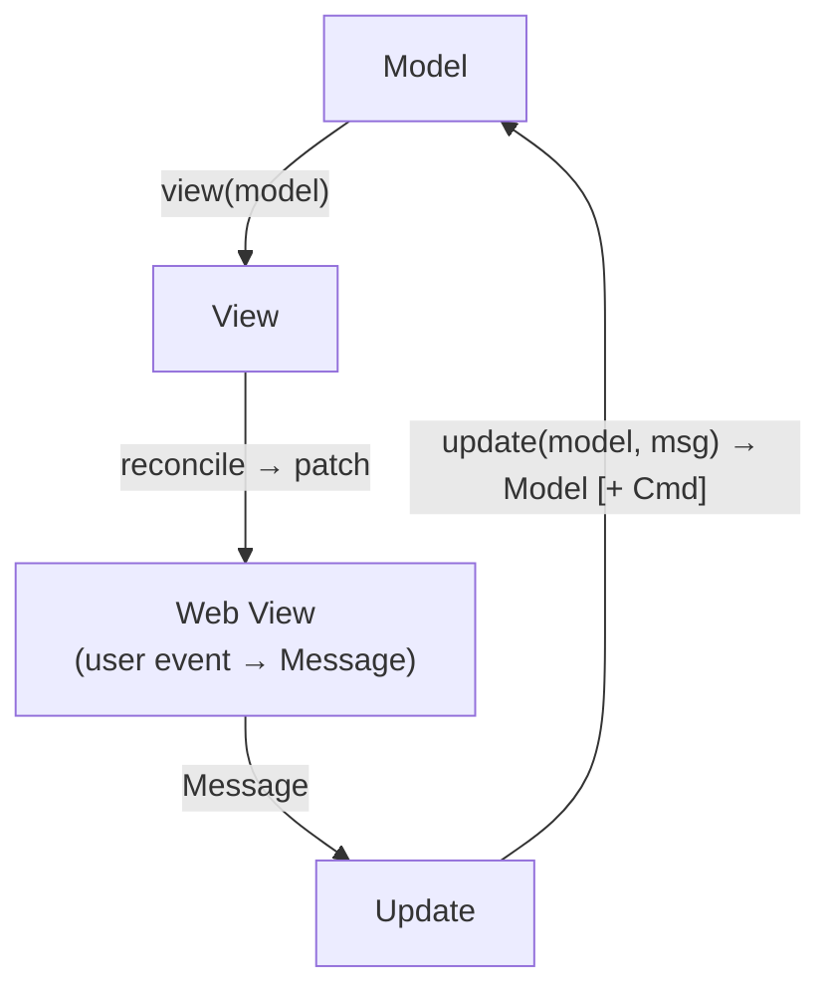

# Luma — Solaris Architecture

> A beginner-friendly, cross-platform **Luma** GUI framework built on the
> **Model-View-Update (MVU)** architecture, rendered through a hidden **web view**.
> Beginners write **only Luma** — never HTML, CSS, or JavaScript. A blank app already
> looks polished, and there is **exactly one obvious way** to do each thing.

*Solaris is a synthesis of four concepts — Serene, Simplo, Lumen, and Aether — keeping the
strongest, safest, and simplest idea from each.*

> **About this document.** This is the **design concept** behind Luma's
> beginner-first GUI. Luma ships this concept as a built-in standard-library module named
> [`Solaris`](Luma_Solaris_Guide.md): the `Model` is a `record`, each `Message` is a
> `choice` type, modifier chains are expressed with Luma's pipe operator (`|>`), and the whole
> thing renders through a hidden, hardened webview — the [`GraphicalUi`](Luma_GraphicalUi_Guide.md)
> engine. This document captures the philosophy, architecture, and rationale of the *full*
> vision; the shipped `Solaris` surface covers the common, beginner-friendly subset and grows
> over time. Code samples here use the `Solaris.*` namespace to describe the design;
> they illustrate the *full* vision, so some go beyond what the shipped surface
> covers today (see the
> [Solaris Guide](Luma_Solaris_Guide.md) for the exact shipped API). Every sample is Luma —
> no HTML, CSS, or JavaScript.

---

## Table of Contents

1. [Design Philosophy](#1-design-philosophy)
2. [Architecture & Implementation](#2-architecture--implementation)
3. [The MVU Loop, Messages & Effects](#3-the-mvu-loop-messages--effects)
4. [UI Components](#4-ui-components)
5. [Layout Mechanisms](#5-layout-mechanisms)
6. [Styling Mechanisms](#6-styling-mechanisms)
7. [Default Layouts & Stylings (Design Tokens)](#7-default-layouts--stylings-design-tokens)
8. [Security, Safety & Accessibility](#8-security-safety--accessibility)
9. [Complete Examples](#9-complete-examples)
10. [Limitations & Non-Goals](#10-limitations--non-goals)
11. [Implementation Roadmap](#11-implementation-roadmap)
12. [Inspiration Summary](#12-inspiration-summary)

---

## 1. Design Philosophy

Solaris is guided by seven rules, in priority order:

| # | Principle | Meaning | Origin |
|---|-----------|---------|--------|
| 1 | **Simplicity beats power** | If a feature confuses a beginner, it is cut or hidden behind a default. | Serene, Simplo, Lumen |
| 2 | **One obvious way** | No competing layout systems or styling APIs. | All four |
| 3 | **UI = f(state)** | The screen is a pure function of your data — no manual widget mutation. | Aether, Flutter/SwiftUI |
| 4 | **Predictable data flow** | State changes only through `update` (MVU). | Serene, Lumen |
| 5 | **Batteries included** | Beautiful, accessible defaults out of the box; zero styling to look good. | Aether, Simplo |
| 6 | **Fail-safe by construction** | Immutable values, `result`/`optional` for absence, no manual memory management, no raw threads, no CSS/HTML injection. | All four |
| 7 | **The web is an implementation detail** | HTML/CSS/JS is generated internally and never exposed. | Simplo, Serene §8 |

**Core promise:** *A beginner learns three concepts — Model, View, Update — and can ship a
good-looking, accessible, cross-platform desktop app in one Luma file on day one.*

Luma is a natural fit for these rules: variables are **immutable by default**, values have
**value semantics** (so a `View` tree is just data), and there is **no manual memory
management** — the beginner never meets a pointer, a destructor, or a thread.

---

## 2. Architecture & Implementation

### 2.1 High-Level Structure

Solaris is a **Luma core** that describes the UI as an immutable value tree, plus a **hidden
web view** that renders it. The developer touches only the top layer.

```text
┌──────────────────────────────────────────────────────────────┐
│  APP LAYER (you write this)                                    │
│    Model (record) · Message (choice) · update() · view()       │  ← UNCHANGED across backends
└───────────────────────────────┬──────────────────────────────┘
                                │  pure functions, immutable values
┌───────────────────────────────▼──────────────────────────────┐
│  RUNTIME LAYER                                                 │
│    MVU event loop · message dispatch · Command/Subscription    │
│    scheduler (single-threaded UI)                              │
└───────────────────────────────┬──────────────────────────────┘
┌───────────────────────────────▼──────────────────────────────┐
│  WIDGET LAYER      curated component set → View value tree     │
├──────────────────────────────────────────────────────────────┤
│  LAYOUT ENGINE     Row/Column/Grid/Stack → emits CSS Flexbox   │
├──────────────────────────────────────────────────────────────┤
│  STYLING / THEME   semantic tokens → emits CSS variables       │
├──────────────────────────────────────────────────────────────┤
│  RECONCILER        keyed diff of old vs. new tree → patches    │
├──────────────────────────────────────────────────────────────┤
│  BRIDGE            JSON patch messages ↔ user events (IPC)     │
└───────────────────────────────┬──────────────────────────────┘
                                │  serialized DOM patches (JSON)
┌───────────────────────────────▼──────────────────────────────┐
│  WEB VIEW (platform-native, hidden)                            │
│    WebView2 (Win) · WKWebView (macOS) · WebKitGTK (Linux)      │
│    thin JS runtime applies patches + forwards events           │
└──────────────────────────────────────────────────────────────┘
```

> **Why this layering (from Serene):** the upper layers — and everything a beginner writes —
> are backend-independent. A native GPU renderer could be added later as an optional
> backend without changing a single line of user code. The **web-view backend is the default**
> because it delivers layout, styling, text input, HiDPI, and accessibility *for free*. This is
> exactly how Luma's shipping GUI stack already works: the [`Solaris`](Luma_Solaris_Guide.md)
> surface renders through the hardened [`GraphicalUi`](Luma_GraphicalUi_Guide.md) webview engine.

### 2.2 Key Technical Choices

| Concern | Decision | Rationale |
|---|---|---|
| **Language** | Modern **Luma** (`choice` types, `optional<T>`, `result<T>`, interfaces, record literals + `with`) | Statically typed, expression-oriented, beginner-first |
| **UI description** | Immutable **value tree** rebuilt each update, reconciled by the runtime | Beginners never manage widget lifetimes (Serene/Aether); Luma values are immutable by default |
| **View node** | Copyable `View` value; records and choice values with value semantics | Value semantics, no manual memory management (SwiftUI-style) |
| **Messages** | A **`choice` type** — *unit variants* (data-free) **or** *data variants* (carry data) — see §3.2 | Beginners start with unit variants; graduate to data variants when a control must carry input |
| **`update` signature** | Pure `function Model update(Model, Msg)` **or** effectful `function Effect<Model, Msg> update(Model, Msg)` | Beginners use the pure form with `App.new`; effectful apps use `App.effectful` |
| **Web view** | **OS-native** — WebView2 / WKWebView / WebKitGTK | Small binaries, no bundled browser (the same backend as `Solaris`) |
| **Bridge** | Single internal **JSON** channel: Luma sends patches, JS sends events | Hidden from developer |
| **Diffing** | **Keyed reconciliation** (see §3.4); only changed nodes are sent | MVU stays efficient; identical frames are skipped entirely |
| **Threading** | **Single-threaded** UI loop; async work via `Cmd` (backed by Luma tasks) | No data races to explain |
| **Native chrome** | Framework **owns** the window (title, size, resizable) and native notifications | Consistent, documented, finite (Simplo). Menu bar & tray are not exposed by the webview backend — see §4.5 |
| **Build** | **No build step** — `Solaris` is a standard-library module; just `#include`-free `luma app.luma` | Trivial setup |
| **Minimum toolchain** | A Luma interpreter built with web-view support (`LUMA_HAS_WEBVIEW`) | Renders the hidden window; without it, the module reports a clear runtime error |

> **Running an app.** There is nothing to configure or link. Save your program as `app.luma`
> and run `luma app.luma`; the `Solaris` module is built in, exactly like `String` or `Array`.

---

## 3. The MVU Loop, Messages & Effects

Solaris has **exactly one** control flow. A beginner fills in three blanks.



1. **Model** — a plain `record` holding *all* application state.
2. **View** — a pure function `function View view(Model model)` returning the UI tree. Never mutates state.
3. **Update** — a pure function producing a **new** Model from `(Model, Message)`.

The runtime renders `view(model)`, collects events as messages, calls `update`, reconciles the new
tree against the old, and patches only what changed. **The user never writes the loop.**

### 3.2 The Message Model (two levels, one rule)

A `Message` is any `choice` type the developer chooses. Solaris supports two levels of complexity —
and because Luma choice types can mix *unit* and *data* variants in one declaration, the beginner
never has to switch mechanisms; they just add a field to a variant.

**Level 1 — unit variants (data-free events).** Simplest; ideal for buttons, toggles, and
navigation where the event itself carries all meaning:

```luma
choice Msg { Increment  Decrement  Reset }

Solaris.button("+") |> Solaris.on_click(Msg.Increment)   # bare message value
```

**Level 2 — data variants (events that carry data).** **Required** whenever a control produces a
*value* the model must store (text input, slider position, dropdown selection, or *which list item*
was acted on). The control's handler takes a **mapping function** that turns the raw value into a
typed message:

```luma
choice Msg {
    SetName(string value)
    # ... other variants ...
}

Solaris.text_field(model.name)
    |> Solaris.on_change((string value) -> Msg.SetName(value))
```

> **The one rule:** if a control emits *data*, its handler is a function `(value) -> Message`;
> if a control emits only *intent*, its handler is a bare `Message`. This is the single point
> where a beginner moves from a unit variant to a data variant — and the type checker guides them
> there, because a unit variant like `Msg.SetName` cannot hold the input string until you give it a
> `string value` field.

> **Why a `choice` maps so cleanly.** In C++ this ladder crossed two different tools — an
> `enum class` and a `std::variant`. In Luma it is **one** construct: a `choice` type whose
> variants may or may not carry data. `match` handles both uniformly and **exhaustively**, so the
> type checker fails the build if you forget a message.

### 3.3 Effects & Startup (kept out of the beginner's way)

Side effects (HTTP, timers, files) must **not** live inside `update`. Beginners use the pure form;
the effectful form is opt-in. Because a Luma function has a single declared return type, Solaris
offers two clearly-named shapes rather than C++ template magic:

```luma
# Beginner form (pure, no side effects):
function Model update(Model model, Msg msg)

# Advanced form (managed side effects via Commands):
function Effect<Model, Msg> update(Model model, Msg msg)
```

A `Cmd<Message>` runs work off the UI thread and posts a `Message` back when done — **no raw
threads, no callbacks stored across the codebase, purity preserved** (Elm/Serene model). Build the
effectful result with `Solaris.with_command(model, cmd)`, or `Solaris.pure(model)` when a branch has no
effect:

```luma
choice Msg {
    Refresh
    DataLoaded(string body)
}

function Effect<Model, Msg> update(Model model, Msg msg) {
    return match msg {
        case Msg.Refresh {
            Solaris.with_command(model,
                Cmd.http_get("https://api.example.com/status",
                    (result<string> response) -> match response {
                        success(body) { Msg.DataLoaded(body) }
                        failure(_)    { Msg.DataLoaded("") }
                    }))
        }
        case Msg.DataLoaded(body) {
            Solaris.pure(model with { status = body })
        }
    }
}
```

- **Startup effects:** the `App` builder accepts an optional initial command so an app can *do
  something on launch* (load a file, start a clock): `App.new(...) |> App.init_cmd(Cmd.http_get(...))`.
- **Subscriptions** (`Sub<Message>`) turn ongoing sources — timers, window events, file watchers —
  into a stream of messages, again without touching threads:
  `App.new(...) |> App.subscribe((Model m) -> [Sub.every(1000, (integer _) -> Msg.Tick)])`.

> **Why MVU is beginner-friendly:** no mutable widget state, no `set_background()`, no manual
> refresh, no threading traps. State flows one direction. If the app is wrong, the bug is in
> `update` or `view` — nowhere else.

### 3.4 Lists, Keys & Per-Item Messages

Dynamic collections are where MVU beginners most often stumble, so Solaris makes the pattern explicit.

**Keys.** Any child produced in a loop **should** carry a stable `Solaris.key(id)`. The reconciler
uses keys to match old and new nodes across reorders/removals, preserving focus, animation, and
caret state. Without a key, Solaris falls back to index matching and emits a debug warning for lists
whose length changes.

**Per-item messages.** To know *which* item a click belongs to, the item's message carries its id
(a Level-2 data variant). This is the canonical "list of items" pattern:

```luma
record Item {
    integer id,
    string  text,
    boolean done = false
}

record Model {
    array<Item> items = []
}

choice Msg {
    Toggle(integer id)   # carries which item
    Remove(integer id)
}

function Model update(Model model, Msg msg) {
    return match msg {
        case Msg.Toggle(id) {
            array<Item> next = Array.map(model.items,
                (Item it) -> if it.id == id { it with { done = !it.done } } else { it }
            ) ?? model.items
            model with { items = next }
        }
        case Msg.Remove(id) {
            array<Item> next = Array.filter(model.items,
                (Item it) -> it.id != id) ?? model.items
            model with { items = next }
        }
    }
}

function View view(Model model) {
    array<View> rows = Array.map(model.items, (Item it) -> {
        integer id = it.id                                     # capture by value
        return Solaris.row([
            Solaris.checkbox(it.text, it.done)
                |> Solaris.on_toggle((boolean _) -> Msg.Toggle(id)),
            Solaris.button("Delete")
                |> Solaris.danger()
                |> Solaris.on_click(Msg.Remove(id))
                |> Solaris.label("Delete ${it.text}")
        ]) |> Solaris.key(id)                                     # stable key
    }) ?? []

    return Solaris.list(rows)
}
```

> **Immutability makes this safe.** `it with { done = !it.done }` produces a *new* `Item`; the
> original is untouched. `Array.map`/`Array.filter` return a `result`, so `?? model.items` supplies
> the current list as a fallback — the update can never leave the model in a half-changed state.

---

## 4. UI Components

A **small, curated, closed set** (~30) — enough for real apps, learnable in an afternoon. Each is
a Luma factory function under the `Solaris` namespace returning a `View`, and **every one looks
correct with zero configuration**.

### 4.1 Text & Display

| Component | Signature | Purpose |
|-----------|-----------|---------|
| `Solaris.text` | `Solaris.text(str)` | Any text/label |
| `Solaris.heading` | `Solaris.heading(str, level)` | Titles (levels 1–3) |
| `Solaris.icon` | `Solaris.icon(name)` | Built-in icon set (names only — no remote URLs) |
| `Solaris.image` | `Solaris.image(src)` | Pictures (bundled asset path or explicitly allow-listed URL — see §8) |
| `Solaris.divider` | `Solaris.divider()` | Separator line |
| `Solaris.badge` | `Solaris.badge(text)` | Small status label |

### 4.2 Input & Controls

`options` in the controls below is an `array<string>` of display labels; `selected` is a 0-based
index (an `integer`) or the current value.

| Component | Signature | Emits |
|-----------|-----------|-------|
| `Solaris.button` | `Solaris.button(label)` | `\|> Solaris.on_click(Msg)` — bare message |
| `Solaris.text_field` | `Solaris.text_field(value)` | `\|> Solaris.on_change((string) -> Msg)` |
| `Solaris.text_area` | `Solaris.text_area(value)` | `\|> Solaris.on_change((string) -> Msg)` |
| `Solaris.checkbox` | `Solaris.checkbox(label, checked)` | `\|> Solaris.on_toggle((boolean) -> Msg)` |
| `Solaris.switch` | `Solaris.switch(checked)` | `\|> Solaris.on_toggle((boolean) -> Msg)` |
| `Solaris.radio` | `Solaris.radio(options, selected)` | `\|> Solaris.on_select((integer) -> Msg)` |
| `Solaris.dropdown` | `Solaris.dropdown(options, selected)` | `\|> Solaris.on_select((integer) -> Msg)` |
| `Solaris.slider` | `Solaris.slider(value, min, max)` | `\|> Solaris.on_change((number) -> Msg)` |
| `Solaris.date_picker` | `Solaris.date_picker(value)` | `\|> Solaris.on_change((string) -> Msg)` |

> **Beginner convenience.** A control's message handler is the *last* thing you pipe on, so the
> factory call reads left-to-right like a sentence: "a text field showing `model.name`, whose
> changes become a `SetName` message".

### 4.3 Containers & Structure

| Component | Signature | Purpose |
|-----------|-----------|---------|
| `Solaris.row` | `Solaris.row([...])` | Horizontal group |
| `Solaris.column` | `Solaris.column([...])` | Vertical group |
| `Solaris.grid` | `Solaris.grid([...]) \|> Solaris.columns(n)` | Uniform n-column grid, wraps automatically |
| `Solaris.stack` | `Solaris.stack([...])` | Layered / overlapping group (z-order) |
| `Solaris.card` | `Solaris.card([...])` | Elevated content container |
| `Solaris.scroll_view` | `Solaris.scroll_view([...])` | Scrollable region |
| `Solaris.list` | `Solaris.list(items)` | Vertical list of Views (use `Solaris.key()` on children — §3.4) |
| `Solaris.table` | `Solaris.table(headers, rows)` | Simple data table (`rows` = `array<array<View>>`) |
| `Solaris.tabs` | `Solaris.tabs([(label, content), ...])` | Tabbed sections |

### 4.4 Navigation, Overlays & Feedback

| Component | Signature | Purpose |
|-----------|-----------|---------|
| `Solaris.app_shell` | `Solaris.app_shell(sidebar, content, title)` | Top-level frame |
| `Solaris.sidebar` | `Solaris.sidebar([...])` | Navigation sidebar |
| `Solaris.dialog` | `Solaris.dialog([...])` | Modal popup |
| `Solaris.toast` | `Solaris.toast(message)` | Transient notification |
| `Solaris.menu` | `Solaris.menu([...])` | Context / dropdown menu |
| `Solaris.spinner` | `Solaris.spinner()` | Loading indicator |
| `Solaris.progress_bar` | `Solaris.progress_bar(value)` | Determinate progress (0.0–1.0) |

### 4.5 Native (owned by the core, not the web view)

The framework **owns** the OS window and configures it through the `App` builder:
**Window** (title, size, min/max, resizable, fullscreen) and **native notifications**
(`Cmd.notify`), plus native **file download** (`Cmd.download_file`) and **open-in-browser**
(`Cmd.open_url`). These return messages like any other event source.

> **Honest limitation (from the webview backend).** A native **menu bar**, **system-tray icon**,
> and **custom window icon** are *not* exposed by the cross-platform web-view backend. Build
> in-window navigation instead — an `Solaris.toolbar`, `Solaris.menu`, or the `Router` (§3.3 subscriptions
> and routing). This matches the shipping `Solaris` module exactly, so the promise stays finite
> and truthful.

> **Design rule:** the component list is *deliberately closed and small*. Everything else is
> composition. Advanced/rare widgets (pane grids, canvas, markdown) live in an optional
> `solaris-extra` package, never in the beginner core (Serene).

---

## 5. Layout Mechanisms

**One layout model only: a simplified Flexbox**, exposed as beginner-friendly Luma primitives and
emitted internally as CSS Flexbox/Grid. Beginners never learn CSS, `justify-content` vs
`align-items`, floats, or z-index.

### 5.1 The Four Primitives

| Primitive | Behavior |
|-----------|----------|
| `Solaris.row([...])` | Children left → right |
| `Solaris.column([...])` | Children top → bottom |
| `Solaris.grid([...]) \|> Solaris.columns(n)` | Uniform n-column grid, wraps automatically |
| `Solaris.stack([...])` | Children layered by z-order |

Nesting Rows and Columns expresses *any* one-dimensional-flow layout — that is the entire mental
model. `Grid` handles tabular layouts; `Stack` handles layering.

### 5.2 Sizing Model (Serene's `Length` — one concept for all stretching)

Every widget's width/height is one value of the `Length` choice type. **`Length` is the single
mechanism for sizing and stretching** — there is no separate `.grow()`, keeping "one obvious way"
intact:

```luma
choice Length {
    Shrink                    # as small as the content (default)
    Fill                      # take all available space
    FillPortion(integer weight)   # take a proportional share (flex-grow weight)
    Fixed(number points)      # exact logical-point size
}
```

| Length | Meaning | Emitted (internal) |
|--------|---------|--------------------|
| `Length.Shrink` *(default)* | As small as the content | `flex: 0 0 auto` |
| `Length.Fill` | Take all available space | `flex: 1 1 0` |
| `Length.FillPortion(n)` | Take a proportional share | `flex: n 1 0` |
| `Length.Fixed(pt)` | Exact logical-point size | `width/height: <pt>` |

```luma
Solaris.row([
    Solaris.text("Left"),
    Solaris.button("Right")
        |> Solaris.on_click(Msg.Go)
        |> Solaris.width(Length.Fill)    # stretches to fill
])
```

### 5.3 Layout Modifiers (chainable via `|>`, named scale — no raw pixels)

Luma's pipe operator is Solaris's answer to C++ method chaining: each modifier takes the container as
its first argument and returns a new container, so they compose left-to-right.

```luma
Solaris.column([ /* ... */ ])
    |> Solaris.gap(Spacing.M)                  # space between children
    |> Solaris.padding(Spacing.L)              # inner space
    |> Solaris.align(Align.Center)             # cross-axis alignment
    |> Solaris.justify(Justify.SpaceBetween)   # main-axis distribution
```

| Modifier | Options |
|----------|---------|
| `Solaris.gap()` / `Solaris.padding()` / `Solaris.margin()` | Spacing tokens (`Spacing.None…Spacing.XL`) |
| `Solaris.align()` | `Align.Start, Align.Center, Align.End, Align.Stretch` (cross-axis) |
| `Solaris.justify()` | `Justify.Start, Justify.Center, Justify.End, Justify.SpaceBetween, Justify.SpaceAround` (main-axis) |
| `Solaris.width()` / `Solaris.height()` | a `Length` (see §5.2) |
| `Solaris.center()` | shorthand: center this container's **children** on both axes |
| `Solaris.wrap()` | flow children to next line when they overflow |
| `Solaris.scroll()` | scroll on overflow instead of clipping |

> **Deliberately excluded from the core:** absolute positioning, constraint solvers, competing
> managers. Beginners choose from a **named scale**, guaranteeing visual rhythm. A documented
> "advanced" raw escape hatch exists but is intentionally under-promoted (Lumen).

---

## 6. Styling Mechanisms

Styling uses **semantic design tokens + chainable modifiers**, never raw CSS. There is exactly
one styling approach, offered as a three-level ladder (Aether) so beginners grow gradually.

### 6.1 Three Levels of Styling

**Level 1 — Do nothing (the primary path).** Every component looks great by default.

**Level 2 — Semantic variants (one word).** These variants are shared across interactive
components (`button`, `card`, `text`, …), so `Solaris.primary()`, `Solaris.danger()`, `Solaris.muted()`, and
`Solaris.elevated()` mean the same thing everywhere:

```luma
Solaris.button("Delete") |> Solaris.danger()
Solaris.button("Save")   |> Solaris.primary()
Solaris.button("Reset")  |> Solaris.muted()      # works on button, text, and other components
Solaris.card([ /* ... */ ]) |> Solaris.elevated()
Solaris.text("Note")     |> Solaris.muted()
```

**Level 3 — Modifier chains (when needed):**

```luma
Solaris.text("Title")
    |> Solaris.size(TextSize.Large)
    |> Solaris.weight(Weight.Bold)
    |> Solaris.color(Color.Primary)     # semantic role, not raw hex
    |> Solaris.rounded(Radius.Medium)
```

### 6.2 Semantic Tokens (meanings, not raw values)

Each token is a variant of a `choice` type, so an invalid token is a *compile error*, not a
run-time surprise:

| Category | Tokens |
|----------|--------|
| **Colors** | `Color.Primary, Color.Secondary, Color.Success, Color.Warning, Color.Danger, Color.Surface, Color.Background, Color.TextPrimary, Color.TextMuted, Color.Border` (each with tonal steps `50–900` for hover/active/disabled — from Lumen) |
| **Spacing** | `Spacing.None, Spacing.XS, Spacing.S, Spacing.M, Spacing.L, Spacing.XL` (fixed 4-pt scale) |
| **Text sizes** | `TextSize.Caption, TextSize.Body, TextSize.Large, TextSize.Heading, TextSize.Title` |
| **Radius** | `Radius.None, Radius.Small, Radius.Medium, Radius.Large, Radius.Full` |
| **Elevation** | `Elevation.Flat, Elevation.Raised, Elevation.Floating` |

### 6.3 The Theme System

A single `Theme` value holds all tokens. Change one line → the whole app restyles. Widgets read
from the active theme, so custom themes and dark mode are **one builder chain away**:

```luma
Theme my_theme = Theme.light()
    |> Theme.accent(Solaris.hex("#4F46E5"))
    |> Theme.corner_radius(Radius.Medium)
    |> Theme.font("Inter")
```

`Theme.light()`, `Theme.dark()`, and `Theme.auto()` (follows the OS) are built in; all semantic
colors have light/dark variants, so **dark mode is free**.

### 6.4 Style Encapsulation & Escape Hatch

- Because the developer never writes global CSS, **class collisions are impossible** — output is
  scoped by construction (Lumen/Lit-inspired).
- A single `Solaris.style(raw_css)` power-user hatch exists but is intentionally under-documented and
  **sanitized** (see §8) to keep the beginner path clean and safe.

> Tokens compile down to **CSS variables** inside the web view; a theme swap is a single `:root`
> variable-block swap. Users never see or write CSS.

---

## 7. Default Layouts & Stylings (Design Tokens)

*"Looks good with zero configuration"* is a core promise. Defaults follow a modern, clean,
accessible baseline (Material 3 / Fluent / Apple HIG). **All values are overridable.**

> **Units note:** sizes are expressed in **logical points (pt)**, auto-scaled for display density.
> Shadow blur/offset values below are shown in CSS `px` because they are emitted verbatim into CSS
> and are DPI-scaled by the web view along with everything else.

### 7.1 Colors

| Token | Light | Dark | Usage |
|-------|-------|------|-------|
| `Color.Primary` | `#4F46E5` | `#6366F1` | Main actions, accents |
| `Color.Secondary` | `#7C3AED` | `#8B5CF6` | Secondary actions |
| `Color.Success` | `#16A34A` | `#22C55E` | Positive states |
| `Color.Warning` | `#D97706` | `#F59E0B` | Cautions |
| `Color.Danger` | `#DC2626` | `#EF4444` | Destructive actions |
| `Color.Background` | `#FFFFFF` | `#0F172A` | App background |
| `Color.Surface` | `#F8FAFC` | `#1E293B` | Cards, panels |
| `Color.TextPrimary` | `#0F172A` | `#F1F5F9` | Main text |
| `Color.TextMuted` | `#64748B` | `#94A3B8` | Secondary text |
| `Color.Border` | `#E2E8F0` | `#334155` | Dividers, outlines |

Each color exposes tonal steps `50–900` for interaction states.

### 7.2 Typography

| Property | Default |
|----------|---------|
| Font family | **Inter** (bundled), then system-ui stack: `-apple-system, "Segoe UI", Roboto, sans-serif` |
| Base size | `16 pt` (`TextSize.Body`) |
| Type scale | Caption `12` · Body `16` · Large `18` · Heading `24` · Title `32` |
| Line height | `1.5` (body), `1.2–1.3` (headings) |
| Weights | Regular `400`, headings/buttons `600` |

### 7.3 Spacing Scale (4-pt base grid)

| Token | Value |
|-------|-------|
| `Spacing.XS` | 4 pt |
| `Spacing.S` | 8 pt |
| `Spacing.M` | 16 pt *(default gap & padding)* |
| `Spacing.L` | 24 pt |
| `Spacing.XL` | 32 pt |

- Default container padding: **M (16)** · Default gap: **S (8)** · Default card padding: **L (24)**.

### 7.4 Sizing & Scaling

| Aspect | Default |
|--------|---------|
| Units | **Logical points**, auto-scaled by web-view DPI (HiDPI/Retina free) |
| Button / Input height | `40 pt` |
| Icon size | `20 pt` |
| Min touch target | `44 pt` |
| Default component width | Fits content (`Length.Shrink`); stretches only with `Fill`/`FillPortion` |
| Window default size | `960 × 640 pt` (min `400 × 300`) |

### 7.5 Corner Radius & Elevation

| Radius | Value | Elevation | Shadow |
|--------|-------|-----------|--------|
| `Radius.Small` | 4 pt | `Elevation.Flat` | none |
| `Radius.Medium` *(default)* | 8 pt | `Elevation.Raised` | `0 1px 3px rgba(0,0,0,.10)` |
| `Radius.Large` | 16 pt | `Elevation.Floating` | `0 8px 24px rgba(0,0,0,.15)` |

### 7.6 Alignment & Stretching Defaults

| Container | Main-axis | Cross-axis |
|-----------|-----------|------------|
| `Solaris.column` | `Justify.Start` (top) | `Align.Stretch` (fill width) |
| `Solaris.row` | `Justify.Start` (left) | `Align.Center` |
| `Solaris.grid` | even distribution | `Align.Stretch` |

- Children **do not stretch** unless `Length.Fill`/`Length.FillPortion` is set (predictable, explicit).
- Text is start-aligned and **locale-aware** (left in LTR, right in RTL).

### 7.7 Animation Defaults (respecting `prefers-reduced-motion`)

| Interaction | Duration | Easing |
|-------------|----------|--------|
| Button hover/press | 150 ms | Standard |
| Dialog open/close | 200 ms | Enter/Exit |
| Toast appearance | 250 ms | Enter |
| Tab / view change | 200 ms | Standard |
| Theme light↔dark | 300 ms | Standard |
| List item add/remove | 200 ms | Enter/Exit |

**Easing curves (Lumen):** Standard `cubic-bezier(0.4, 0, 0.2, 1)` · Enter `cubic-bezier(0, 0, 0.2, 1)` · Exit `cubic-bezier(0.4, 0, 1, 1)`.
Motion is powered by CSS transitions (free with the web view) and can be globally disabled via
`Theme.animations(false)` or automatically via the OS reduced-motion setting.

---

## 8. Security, Safety & Accessibility

Because the web view is an internal implementation detail, Solaris hardens it by default so
beginners inherit safety without thinking about it.

### 8.1 Security (web-view hardening)

- **No arbitrary HTML/JS from user data.** All `Solaris.text`/label values are treated as data and
  HTML-escaped by the serializer — user content can never inject markup or script (prevents XSS).
- **Strict Content-Security-Policy** in the embedded page: everything is denied by default
  (`default-src 'none'`); only the framework's own nonce-tagged bootstrap script runs, and the page
  has **no network access** (`connect-src 'none'`) — HTTP commands go through Luma's native runtime,
  not the page.
- **Minimal, allow-listed bridge:** the JS↔Luma channel exposes only the fixed set of event and
  patch message types — no general "run this code" capability. All inbound messages are validated
  against a schema before dispatch; malformed messages are dropped, not executed.
- **Asset & resource loading is closed by default.** `Solaris.icon(name)` resolves only to the bundled
  icon set. `Solaris.image(src)` loads bundled/local (`data:`/`blob:` and relative) assets by default;
  loading a remote URL requires an explicit `App.allow_remote_images()`, keeping the default CSP
  `img-src` tight and preventing tracking-pixel / SSRF-style leaks.
- The `Solaris.style(raw_css)` escape hatch is **sanitized**: a property allow-list, and no
  `url()`/`@import` to remote origins — so styling can never become a data-exfiltration or
  injection vector.

### 8.2 Fail-safety (from the type system and runtime)

- **Value semantics everywhere** (`Model`, `Message`, `View`) — no dangling references, no manual
  memory management, no shared mutable state.
- **Immutable state + single write path** (`update`) — no race conditions, no partial updates. A
  new model is produced with `with`; the old one is never mutated in place.
- **Single-threaded UI**; all side effects go through managed `Cmd`s / `Sub`scriptions.
- **Absence is a type, not a crash.** `optional<T>` and `result<T>` model missing values and
  failures, so "no data yet" is handled in `match`, never by a null dereference.
- **Error containment:** if `view` or `update` raises, the runtime catches it at the loop boundary,
  keeps the last good frame on screen, and surfaces a clear diagnostic — a stray error never blanks
  the window. Provide an optional `App.on_error((string) -> View)` to render your own friendly
  error screen; otherwise the message appears as a dismissible toast over the last good frame.

### 8.3 State Persistence (opt-in)

Because the entire app state is one serializable `Model`, Solaris offers optional one-line
persistence: `App.persist("app.state")` saves the Model as JSON on exit and restores it on launch.
This is opt-in (privacy-respecting).

> **JSON round-trip note.** The model is stored as JSON, so it must be JSON-representable
> (booleans, numbers, strings, arrays, dictionaries). A `record` model is restored as a
> **dictionary** with the same fields; normalise it back into your record in an `App.init` hook if
> you rely on record types downstream. Values with no JSON form (functions, tasks, channels,
> sockets) cannot be persisted, and an unreadable file is ignored with a warning rather than
> crashing the app.

### 8.4 Responsiveness & Accessibility

**Input responsiveness.** Text inputs echo keystrokes **locally in the web view first**, then
reconcile with the model, so typing is never blocked by the Luma↔JS round-trip and the caret never
jumps. `on_change` fires on each edit; an `on_commit` variant fires only on blur/Enter for
expensive updates. This keeps controlled inputs responsive despite the async bridge.

**Accessibility (largely free via semantic HTML):**

- Components emit semantic HTML → **screen readers work out of the box**.
- **Icon-only / symbol-only controls require an accessible name.** A button whose visible content
  is only an `Solaris.icon` or a glyph like `"+"` must add `|> Solaris.label("Add")`; in debug builds
  Solaris warns if a control has no discernible accessible name.
- Visible **focus ring** (2 pt `Color.Primary` outline) on all interactive elements; full keyboard nav.
- Default token pairs guarantee **WCAG AA contrast (≥ 4.5:1)** and are contrast-checked; custom
  themes are validated and warn (in debug) if a token pair falls below AA.
- Native `<input>` gives free caret, selection, IME, and OS text-scaling support.
- Minimum touch target **44 pt**.

---

## 9. Complete Examples

### 9.1 Counter (unit-variant messages — the simplest form)

```luma
record Model {
    integer count = 0
}

choice Msg { Increment  Decrement  Reset }

function Model update(Model model, Msg msg) {
    return match msg {
        case Msg.Increment { model with { count = model.count + 1 } }
        case Msg.Decrement { model with { count = model.count - 1 } }
        case Msg.Reset     { model with { count = 0 } }
    }
}

function View view(Model model) {
    return Solaris.card([
        Solaris.heading("Counter", 1),
        Solaris.text("${model.count}") |> Solaris.size(TextSize.Title),
        Solaris.row([
            Solaris.button("-")     |> Solaris.on_click(Msg.Decrement) |> Solaris.label("Decrement"),
            Solaris.button("Reset") |> Solaris.on_click(Msg.Reset)     |> Solaris.muted(),
            Solaris.button("+")     |> Solaris.on_click(Msg.Increment) |> Solaris.primary()
                                 |> Solaris.label("Increment")
        ]) |> Solaris.gap(Spacing.S) |> Solaris.justify(Justify.Center)
    ]) |> Solaris.padding(Spacing.L)
}

@main
function void main() {
    App.new(Model {}, update, view)
        |> App.title("My First Solaris App")
        |> App.theme(Theme.light())     # or Theme.dark() / Theme.auto()
        |> App.run()
}
```

### 9.2 Form (data-carrying messages)

```luma
record Model {
    string  name = "",
    boolean subscribed = false
}

# Data-carrying events require data variants (see §3.2):
choice Msg {
    SetName(string value)
    SetSubscribed(boolean value)
}

function Model update(Model model, Msg msg) {
    return match msg {
        case Msg.SetName(value)       { model with { name = value } }
        case Msg.SetSubscribed(value) { model with { subscribed = value } }
    }
}

function View view(Model model) {
    string greeting = if model.subscribed { "Thanks, ${model.name}!" } else { "" }

    return Solaris.column([
        Solaris.heading("Welcome", 1),
        Solaris.text_field(model.name)
            |> Solaris.placeholder("Your name")
            |> Solaris.on_change((string value) -> Msg.SetName(value)),
        Solaris.switch(model.subscribed)
            |> Solaris.label("Subscribe to newsletter")
            |> Solaris.on_toggle((boolean on) -> Msg.SetSubscribed(on)),
        Solaris.text(greeting) |> Solaris.color(Color.Success)
    ]) |> Solaris.gap(Spacing.M) |> Solaris.padding(Spacing.L)
}

@main
function void main() {
    App.new(Model {}, update, view)
        |> App.theme(Theme.auto())
        |> App.run()
}
```

> For the canonical dynamic-list example with keys and per-item messages, see §3.4.

All examples are complete, styled, animated, accessible, dark-mode-ready, HiDPI, cross-platform
desktop apps — with **no HTML, no CSS, no manual layout math, no memory management, and no threads.**

---

## 10. Limitations & Non-Goals

Being honest about scope is part of being beginner-friendly. Solaris deliberately does **not** aim to:

- **Render at game/animation frame rates or draw custom canvases.** The web view targets typical
  UI motion, not 60 fps custom graphics. Pixel-level drawing is a future job for an optional
  native GPU backend, not the beginner core.
- **Handle very large virtualized data grids** (100k+ live rows). `list`/`table` suit ordinary app
  sizes; heavy virtualization lives in `solaris-extra`.
- **Run without an OS web view.** WebView2/WKWebView/WebKitGTK must be present (true on modern
  Windows/macOS/Linux, but it is a runtime dependency, and startup/memory cost is higher than a
  pure-native renderer). Without web-view support the module reports a clear runtime error.
- **Expose a native menu bar, system tray, or custom window icon.** The cross-platform web-view
  backend does not surface these; use in-window navigation (`toolbar`, `menu`, `Router`) instead.
- **Support multi-window / MDI in v1.** The default model is one primary window plus native
  notifications and dialogs; multi-window is a later addition.
- **Expose HTML/CSS/JS as an API.** The web layer stays an implementation detail; the `Solaris.style()`
  escape hatch is intentionally minimal and sanitized.
- **Provide a plugin ecosystem of third-party widgets in the core.** The component set is closed
  and curated by design; extensions live in `solaris-extra`.

These constraints are the *cost* of the framework's simplicity, safety, and "one obvious way"
guarantees — and they are acceptable for its target audience.

---

## 11. Implementation Roadmap

Suggested build order for the runtime (web-view backend first — the fastest,
simplest path). Much of this already exists in Luma: the
[`GraphicalUi`](Luma_GraphicalUi_Guide.md) module provides the hardened webview backend and keyed
reconciler, and the built-in [`Solaris`](Luma_Solaris_Guide.md) surface layers the typed,
records-and-choice-types API on top.

1. **Web-view backend** + hardened bridge, CSP, schema validation, and JSON patch protocol.
2. **Layout engine** — Row/Column/Grid/Stack + `Length` resolution → CSS Flexbox/Grid emission.
3. **Core widgets** — `text, button, text_field, card, row, column`.
4. **MVU runtime** — event loop, message dispatch, **keyed** reconciliation/diffing, error containment.
5. **Theme & default design system** — light/dark/auto tokens, typography, spacing, motion (§7).
6. **Remaining widgets** — inputs, containers, feedback, navigation, overlays.
7. **Effects** — `Cmd`/`Sub`, startup `init_cmd`, local-echo inputs; optional state persistence.
8. **Native chrome** — window sizing/title, native notifications, download, open-URL.
9. **`solaris-extra`** — virtualized tables, pane grids, canvas (kept out of the beginner core).
10. **Optional native GPU backend** — same user API, for pixel-level control.

---

## 12. Inspiration Summary

| From | Solaris took | Solaris rejected |
|------|-----------|---------------|
| **Elm (MVU)** | Strict Model-View-Update, pure functions, managed effects (`Cmd`/`Sub`), keyed virtual-DOM diffing, `init` command | — |
| **Luma** | `choice` types for the unit→data message ladder, records + `with` for immutable updates, `match` exhaustiveness, the pipe operator as fluent chaining, `result`/`optional` for safety | Manual memory management; return-type overloading magic |
| **Serene** | Layered/pluggable architecture, `Length` sizing model, explicit web-view mapping, effects opt-in | Shipping the native backend first |
| **Simplo (Electron/Tauri)** | Native OS window ownership, `Stack` layering, points+HiDPI, reduced-motion, small binaries | Bundled browser; blank-canvas defaults |
| **Lumen** | Tonal color steps (50–900), explicit easing curves, scoped-style guarantee, disciplined escape hatch | Fragmented styling |
| **Aether** | Three-level styling ladder, semantic tokens, `app_shell`/`sidebar`, bundled Inter, guaranteed contrast | Self-drawn engine; API complexity |
| **Flutter / SwiftUI** | UI = f(state), value-type views, modifier chains, semantic adaptive colors | Heavy class hierarchies |
| **Web platform** | Flexbox, CSS transitions, font/DPI handling, semantic HTML accessibility, native inputs | Everything else stays hidden |

---

### Core Takeaway

**Solaris = MVU (Elm) + declarative value-tree views (Flutter/SwiftUI) + a hidden, hardened
web-view backend (thin Luma) + a complete semantic design system — with exactly one way to do each
thing, and safety, accessibility, and polish built in by default.**

A beginner builds a real, good-looking, secure, accessible, cross-platform desktop app on their
first day — writing nothing but clean, predictable Luma: a `record` for state, a `choice` for
messages, and two pure functions, `update` and `view`.

---

## See Also

- [Solaris Tutorial](Luma_Solaris_Tutorial.md) — a step-by-step, beginner-first introduction to building apps on the surface
- [Solaris Guide](Luma_Solaris_Guide.md) — the practical, task-oriented guide to building apps on the shipped `Solaris` surface
- [GraphicalUi Guide](Luma_GraphicalUi_Guide.md) — the low-level webview engine that renders the surface, and its raw API
- [User Manual](Luma_User_Manual.md) — language syntax and semantics behind the surface's records, choice types, and pipes

---

*End of merged concept document, adapted to Luma.*
